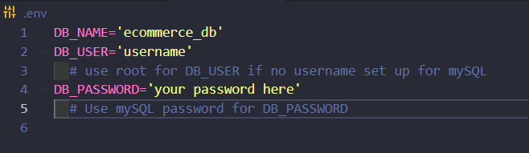

# 

Object-Relational Mapping (ORM)

## Description

When running a company of any size, it is important to keep track of all assets regarding human resources. This includes, but not limited to: department, department budgets, roles within the company, salaries for those roles, employees and the specifics regarding employees. This project aims at creating an easy to use and intuitive program for creating databases to house any information a business may need when tracking their staff.

Through the use of Inquirer, mySQL2, and the command line, this program will ask the user a series of questions before updating the database with the answers of the user. A challenge faced while creating this project was trying to get multiple tables to have relations with each other and display only relevant information to the user based off of what the user wanted to see. This solves the problem of eliminating the time and effort the user has to do in regards of sifting through unwanted information and giving them just what they need.

## Table of Contents

- [Installation](#installation)
- [Usage](#usage)
- [License](#license)
- [Contributing](#contributing)
- [Test](#test)
- [Questions](#questions)
- [Credit](#credit)

## Installation

### Programs needed for this project:

- GitBash (windows) or Terminal (Mac)
- Node.js
- Inquirer
- mySQL2
- Insomnia

Locate a suitable place where you would like to download this repository. Once found, copy the repositories SSH or HTTPS to clone through the terminal or download the zipfile from GitHub. After it is downloaded, please ensure that node.js is installed. Once it is installed and at least version 18 or higher, go to your terminal, navigate to the directory that contains this repository. Once there, type in "npm i" to download the required dependencies.

Before launching the application, a mySQL server must be up and running. From the integrated terminal or the command line, please type in "mysql -u root -p" if your mysql account has a password or "mysql -u root" if you do not have a password set up. Once the server has been connected, please navigate to the db folder and type in "SOURCE schema.sql;". After sourcing, please type in the mysql terminal "USE ecommerce_db;"

Once the mySQL server is up and running please create a .env file at the level of server.js. Within that .env file be sure it looks like the following framework with your information filled in for the DB_user & DB_password:

When that .env file is completed navigate to the server.js level and open up a terminal. From there type in "npm run start", "npm start", or "node server.js". Once the server is up, you should see a listening message in the terminal signaling it is on. Navigate over to the Insomnia application to see the various put, get, post, and delete requests you can do.

In insomnia the accepted end points are the following:

GET & POST requests work with these end points

- http://localhost:3001/api/categories/
- http://localhost:3001/api/products/
- http://localhost:3001/api/tags/

GET, PUT, DELETE requests work with these end points

- http://localhost:3001/api/products/:id
- http://localhost:3001/api/categories/:id
- http://localhost:3001/api/tags/:id

## Video Demo

A video walkthrough can be found [here](). This video shows the entire program from initial start up and all the available options.

## Usage

This repository is allowed for use in a learning environment to evaluate and analyze.

## License

    Please see the MIT license found in the repository. To learn more, please click the license badge at the top of the README.MD

## Contributing

- Sequelize for their [modules](hhttps://sequelize.org/)
- mySQL2 for their [modules](https://www.npmjs.com/package/mysql2)
- dotenv for their [modules](https://www.npmjs.com/package/dotenv)
- Express for their [modules](https://expressjs.com/)
- nodemon for their [modules](https://www.npmjs.com/package/nodemon)
- UCI BootCamp for the acceptance criteria.
- AskBCS for their assistance in troubleshooting.

## Test

Use "npm start" in your terminal to activate the server locally. Another option is to use "node server" to get the local server to initiate to view the application locally.

## Known Inquirer Bug

Double enter issue with prompts. If you hit enter twice too fast and add, or update it will act as if two inquirer prompts have been fired and you will see double questions. This is difficult to reproduce, but if it does occur: quit out of the program with Ctrl + C and relaunch the application. More information on this bug can be found on the Inquirer GitHub issues page found [here](https://github.com/moleculerjs/moleculer-cli/pull/72)

## Questions

If you have further questions about this project, please send an email or checkout us out on GitHub.

Email: kyleochata@gmail.com

GitHub Link: https://github.com/kyleochata

## Credit

This project was created by Kyle Etrata
